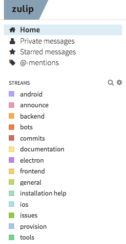
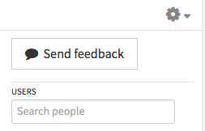
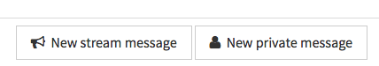
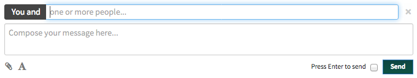

 1. **The Zulip browser window**

    2. There are three panes in your browser window. 
    
       The middle one is the stream of messages.
       
       To its left is a sidebar showing "filters" for different kinds of messages, and below it a menu of streams you are subscribed to. 

       On the right side of the browser window is a sidebar showing users and some configuration settings. 
    
    2. If your browser  window is narrow, you'll see only the message stream or the message stream and the left sidebar. 

 1. **Posting and replying**

    At the bottom of your screen, choose whether to post to a stream or to individual users. 

    2. **Posting and replying to a stream**
    
       3. Click "New stream message" at the bottom of your screen (or select a stream from the list on the left side of your screen). 
       
       3. Enter a stream name, or the beginning of one. Private ("invitation only") streams show a lock next to the name.
       
       3. Enter a topic name — we recommend keeping them brief, and they are truncated after 50 characters.
       
       3. Enter your message.

    2. **Posting and replying to individual users ("PM": private message) **

       3. Enter the name or email address of a user, or the first letters of one. There is no topic when you PM someone.

       3. You can send a message to multiple users at once, by separating their email addresses with a comma. Each recipient will see all the other recipients. For several days, the list of recipients will appear under "GROUP PMs" at the lower right corner of your screen.

    2. **Some facts about messages**

       3. The paperclip icon () under the message field lets you attach files, including images, sound, and video. These are uploaded to a server, but we display a thumbnail if we can.

       3. Zulip uses a subset of [GitHub Flavored Markdown](https://github.com/adam-p/markdown-here/wiki/Markdown-Cheatsheet#tables) (GFM), and the **A** icon under the message field brings up a cheat-sheet for what we support.

       3. If a message is interrupted before you send it, the next time you open the "New stream message" interface you'll see "Restore draft" below the message field. Currently we only save a single interrupted message, and if you leave the Zulip site the message will be deleted.

       3. Type a tab and then the "return" key to click the Send button without having to use your mouse.

       3. Typing "return" will begin a new paragraph within your message; if you want it to send, check the "Press Enter to send" box under the message field. It stays checked until you uncheck it.

       3. If you want greater separation of your paragraphs, enter a non-breaking space (option-space on Macintosh) on a line alone between other paragraphs.

    2. **Editing past messages**

       3. If you want to edit a past message of your own after it has been posted, make sure the mouse is pointing to that message. You should see a little pencil  at the end of the message and a "down-chevron"  near the upper right corner of the message. Clicking either one of these will give you editing options.

       3. If you completely delete the text of a message, you won't be able to save it — so try putting a dash or "(deleted)" in as the message text. ~the fact that there was once a message there will still be evident, and the time stamp of the original posting date and time will still be shown.

 1. **Other common questions**

    2. **Searching**: Zulip searches incrementally as you type, but will only match your typing at the beginning of a stream name. So typing "ep" won't bring up "Help", but "He" will.

    2. **Date of a message**: If you mouse over the time stamp of a message (upper right corner of the message), you'll see a fuller date-time stamp and time zeon.

    2. **Customization**: There are two cogs () that open customization menus: the main one is in the upper right corner of the right sidebar, and there is a smaller one above the list of streams in the left sidebar.

 1. **Streams**

    2. **Subscribe to streams**

    2. **Add streams**

    2. **Configure streams**

       3. Narrow

       3. Mute

       3. Pin

       3. Mark all as read

       3. Stream settings

       3. Choose custom color

    2. **Filtering your streams list**

 1. **Searching**

    2. **Searching for content**

       3. 

    2. **Searching for users**
    
    2. **Searching for a stream: **see** Streams => Filtering your streams list**

 1. **Help**
 
---

User status is marked by little circles to the left of a user's name:

 * active (green circle)
 * not active — recently active but currently qqq (orange half-filled circle),
 * state unknown (white circle)

 The same information is available by mousing over their name.

multiple individual users

Search people — start of names only.

Zulip desktop apps! https://zulip.tabbott.net/apps/. 
    Android
    iPhone
    Cross-platform desktop
    Mac
    Linux
    Windows
    Plan 9

GROUP PMs — stay visible for X days after last activity same user-status circles as for individual users. If some but not all of the users are active, the circle will be a lighter shade of green than qqq

past PMs — clicking on a user shows the whole past conversation history. if you have had group-PM conversations, they will only show up if you "narrow to" private messages with all participants

deleting a message

---

Messages in Zulip go to a *stream* and have a *topic*.

Streams

*Streams* are like chat rooms or mailing lists. You can easily *join*, *leave*, and *make* them.

Topics

The topic of a conversation is one or two words that describe what it is about, for example: Bug #345, lunch, or logo. Don't overthink it. 

Narrowing

You can narrow to a stream or topic by clicking on it, or see messages from all streams at once from your Home view.

Replying

Reply to a message by clicking on it. The stream and topic will automatically be filled in.

Welcome to Zulip

Streams, topics, and narrowing make Zulip conversations efficient and productive.

That's all there is to it, so let's get started!

---

